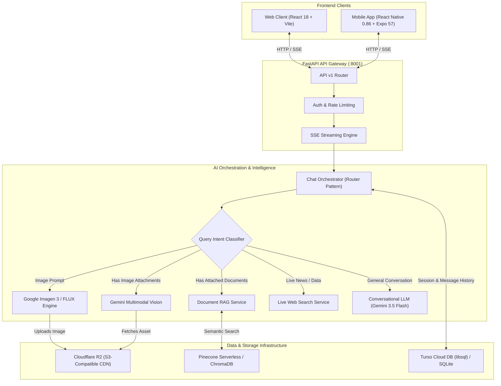

<div align="center">

# Contexify 🧠⚡

**Enterprise-Grade Multimodal AI Knowledge Engine & Assistant**

_Seamlessly integrating Document RAG, Real-Time Web Search, Generative Image Creation, and Multimodal Vision across Web & Mobile platforms._

[](https://python.org)
[](https://fastapi.tiangolo.com)
[](https://react.dev)
[](https://reactnative.dev)
[](https://expo.dev)
[](https://ai.google.dev)
[](https://www.cloudflare.com/products/r2/)
[](https://turso.tech)
[](https://pinecone.io)
[](#-license)

[Features](#-key-features) • [Architecture](#-system-architecture) • [Tech Stack](#-tech-stack) • [Quick Start](#-quick-start) • [Environment Setup](#-environment-configuration) • [Mobile & OTA](#-mobile-deployment--over-the-air-ota-updates) • [Scripts](#%EF%B8%8F-available-scripts)

---

</div>

## 📖 Overview

**Contexify** is an enterprise AI knowledge platform designed for high-precision, low-latency reasoning and conversational discovery. It bridges the gap between static enterprise documents, live real-world web intelligence, vision-driven analysis, and AI image synthesis.

Built as a high-performance monorepo, Contexify provides synchronized clients across desktop Web (**React 18 + TypeScript + Vite**) and native iOS/Android devices (**React Native 0.86 + Expo SDK 57**), supported by a resilient **FastAPI** backend orchestrator with automated hybrid storage (Cloudflare R2, Turso, Pinecone, ChromaDB, and SQLite).

---

## 🌟 Key Features

### 🧠 Intelligent AUTO Mode & Intent Routing

- **Zero-Friction Context Switching**: Contexify defaults to an intelligent `AUTO` engine that determines whether your query needs document context, real-time web data, image generation, visual OCR, or direct reasoning.
- **Intent Pattern Matching**: Automatically detects generative prompts (`/imagine`, `draw me a...`), search indicators (`latest news`, `stock price`), or visual queries (`what is in this diagram?`).
- **Flexible Manual Overrides**: Freely pin specific modes when desired: `AUTO`, `DOCUMENT_RAG`, `WEB_SEARCH`, `MULTIMODAL`, or `IMAGE_GENERATION`.

### 🎨 AI Image Generation & Media Studio

- **Dual-Engine Architecture**: Primary generation powered by Google Imagen 3 (`imagen-3.0-generate-002`), automatically falling back to FLUX when running on Gemini Developer API mode.
- **Interactive Lightbox & Remixing**: Full-resolution image preview modal with pan, zoom, instant download, and prompt remixing directly from the chat timeline.
- **Real-Time Progress Streaming**: Live SSE generation status indicators keeping users informed while artwork renders.

### 👁️ Multimodal Vision & OCR

- **Document & Image Understanding**: Analyze receipts, handwritten notes, architecture diagrams, charts, and infographics via Gemini Vision.
- **Continuous Multi-Turn Context**: Follow up on previously uploaded images across subsequent chat messages without needing to re-upload.
- **Cross-Platform Uploads**: Native camera capture and photo gallery picker on mobile; drag-and-drop file upload on desktop web.

### 🔍 Real-Time Web Search & Grounding

- **Perplexity-Style Numeric Citations**: Inline references (`[1]`, `[2]`) linked to verified sources.
- **Live Search Synthesis**: Aggregates multi-source web snippets with real-time fact retrieval.
- **Interactive Source Cards**: Hover flyouts and collapsible citation drawers with metadata previews and direct source links.

### 📄 Enterprise Document RAG

- **Multi-Format Ingestion**: Upload PDF, TXT, MD, CSV, and DOCX files for semantic Q&A.
- **Hybrid Vector Indexing**: Calibrated 768-dimensional Gemini embeddings stored in **Pinecone Serverless** for cloud production or **ChromaDB** for local development.
- **Context Preservation**: Sliding chunk windows with configurable chunk size (800) and overlap (150) for maximal coherence.

### ☁️ Cloudflare R2 Cloud Storage

- **S3-Compatible Object Store**: All user uploads, generated artwork, avatars, and documents are stored on Cloudflare R2 with global edge delivery.
- **Zero Egress Fees**: Eliminates bandwidth egress costs compared to traditional S3 buckets.
- **Resilient Fallback**: Automatically defaults to local disk storage if cloud credentials are not supplied.

### 🕵️ Incognito / Temporary Chat Mode

- **Zero-Storage Privacy**: Ephemeral chat mode where queries and AI responses are never recorded in SQLite or Turso DB.
- **Guest & Logged-In Support**: Works seamlessly for unregistered guest sessions (`guest_*`) and authenticated user profiles.
- **Visual Status Banner**: Clear incognito banner alerting users that the session will not be saved to history.

### 📱 Native Mobile Application (iOS & Android)

- **Engineered with React Native 0.86 & Expo 57**: Pure 60fps native performance with zero webview wrappers.
- **Real-Time SSE Streaming**: Native `XMLHttpRequest` stream consumer with cancellation, token-by-token buffering, and haptic feedback (`expo-haptics`).
- **Session History Drawer**: Slide-out drawer with recent conversation history, thread deletion, new chat creation, and document listings.
- **Dynamic LAN IP Switcher**: In-app configuration modal allowing instant switching between production backends and local dev IP addresses (`http://192.168.x.x:8001/api/v1`).

### 👥 Enterprise Authentication & Profile Management

- **Google OAuth 2.0**: Fast one-click sign-in with automated profile photo and name synchronization.
- **Passwordless Email OTP**: Secure, rate-limited login and registration dispatched via **Brevo HTTPS REST API** (Port 443, bypassing cloud SMTP port blocks).
- **Hardened Cryptography**: PBKDF2-HMAC-SHA256 password hashing with 100,000 iterations and unique cryptographic salts.
- **Password Strength Analyzer**: Real-time password scoring meter checking length, numbers, symbols, and letter casing.
- **Custom Profile Editor**: In-app avatar upload to Cloudflare R2, display name customization, and preference persistence.

### 🎨 Dynamic Theming & Desktop Experience

- **Adaptive Modes**: True OLED Dark Mode and clean Light Mode.
- **7 Curated Accent Color Palettes**: _Ocean Blue, Royal Purple, Emerald Forest, Sunset Rose, Amber Gold, Cyan Wave, Indigo Night_.
- **Prompt Timeline Rail**: Viewport-pinned timeline with real-time tracking, hover flyout menu, and direct jump navigation.
- **Selective Text Copying**: Granular text selection copying alongside whole-message export, allowing users to copy individual sentences, paragraphs, or code blocks cleanly.

---

## 🏗️ System Architecture



---

## 💻 Tech Stack

| Layer               | Technologies                                                    | Description                                                                  |
| :------------------ | :-------------------------------------------------------------- | :--------------------------------------------------------------------------- |
| **Web Frontend**    | React 18, TypeScript, Vite, Tailwind CSS, Lucide Icons, KaTeX   | Responsive web client with rich markdown, LaTeX math, and code highlighting  |
| **Mobile App**      | React Native 0.86, Expo SDK 57, TypeScript, Expo Haptics        | Cross-platform mobile app with gesture bottom sheets and SSE stream consumer |
| **Backend API**     | Python 3.11+, FastAPI, Uvicorn, Pydantic v2, SSE-Starlette      | Asynchronous REST and Server-Sent Events (SSE) streaming engine              |
| **AI / Reasoning**  | Google Gemini (`gemini-3.5-flash`, `gemini-embedding-001`)      | Calibrated 768-dimensional embeddings and multi-turn contextual reasoning    |
| **AI Image Gen**    | Google Imagen 3 (`imagen-3.0-generate-002`) & FLUX Fallback     | Enterprise text-to-image synthesis and reference-guided remixing             |
| **Object Storage**  | Cloudflare R2 (S3-Compatible via `boto3`) + Local Disk Fallback | High-speed, zero-egress asset storage for documents, avatars, and media      |
| **Relational DB**   | Turso (`libsql-client`) + Local SQLite (WAL Mode)               | Distributed serverless SQLite with automatic schema migrations               |
| **Vector Store**    | Pinecone Serverless + ChromaDB                                  | Scalable high-dimensional semantic search and chunk retrieval                |
| **Auth & Security** | Google OAuth 2.0, Brevo HTTPS REST API, PBKDF2-HMAC-SHA256      | Enterprise identity, passwordless OTP, and cryptographic salting             |

---

## 🚀 Quick Start

### Prerequisites

- **Python 3.11+**
- **Node.js 18+** & **npm**
- _(Optional for Mobile testing)_: **Expo Go** app on iOS or Android, or an active simulator.

---

### 1. Installation

Clone the repository and install all dependencies:

```bash
git clone https://github.com/Prats129/Contexify.git
cd Contexify

# Setup root orchestrator, web frontend, and Python virtual environment
npm install
npm run setup

# Setup mobile dependencies
npm run setup:mobile
```

---

### 2. Environment Configuration

#### Backend Configuration (`backend/.env`)

Copy the template from `backend/.env.example` to `backend/.env`:

```bash
cp backend/.env.example backend/.env
```

Configure your environment variables:

```env
# ------------------------------------------------------------------------------
# 1. Google Gemini API (Required for LLM, Vision & Embeddings)
# ------------------------------------------------------------------------------
GEMINI_API_KEY=your_gemini_api_key_here

# ------------------------------------------------------------------------------
# 2. Database & Vector Store Mode
# "local" (default): Local SQLite (app.db) + Local ChromaDB
# "cloud": Turso Cloud DB + Pinecone Serverless
# ------------------------------------------------------------------------------
DB_MODE=local

# Required if DB_MODE=cloud:
TURSO_DATABASE_URL=libsql://your-db.aws-region.turso.io
TURSO_AUTH_TOKEN=your_turso_jwt_token_here
PINECONE_API_KEY=your_pinecone_api_key_here
PINECONE_INDEX_NAME=contexify
EMBEDDING_DIMENSION=768

# ------------------------------------------------------------------------------
# 3. Cloudflare R2 Object Storage (Images, Documents, Media)
# STORAGE_MODE="cloudflare" (recommended) or "local" (fallback to local disk)
# ------------------------------------------------------------------------------
STORAGE_MODE=cloudflare
CLOUDFLARE_R2_ACCOUNT_ID=your_cloudflare_account_id
CLOUDFLARE_R2_ACCESS_KEY_ID=your_r2_access_key_id
CLOUDFLARE_R2_SECRET_ACCESS_KEY=your_r2_secret_access_key
CLOUDFLARE_R2_BUCKET_NAME=contexify
CLOUDFLARE_R2_PUBLIC_URL=https://pub-your_bucket_id.r2.dev

# ------------------------------------------------------------------------------
# 4. Authentication & Email Dispatch
# ------------------------------------------------------------------------------
GOOGLE_CLIENT_ID=your_google_client_id.apps.googleusercontent.com

# Brevo HTTPS REST API (Recommended for Cloud Hosts / Render - Bypasses SMTP blocks)
BREVO_API_KEY=xkeysib-your_brevo_api_key_here
BREVO_FROM_EMAIL=your_verified_sender@gmail.com
BREVO_FROM_NAME=Contexify
```

#### Frontend Configuration (`frontend/.env`)

```env
VITE_GOOGLE_CLIENT_ID=your_google_client_id.apps.googleusercontent.com
```

---

### 3. Running the Applications

#### Option A: Run Full Stack (Backend + Web Frontend + Mobile)

```bash
npm run dev:all
```

#### Option B: Run Web Full Stack (Backend + Web Frontend)

```bash
npm run dev
```

- **Web Application**: [http://localhost:8000](http://localhost:8000)
- **FastAPI Backend**: [http://127.0.0.1:8001](http://127.0.0.1:8001)
- **Interactive Swagger Docs**: [http://127.0.0.1:8001/docs](http://127.0.0.1:8001/docs)

#### Option C: Run Native Mobile App (Expo)

```bash
npm run dev:mobile
```

- Scan the terminal QR code with **Expo Go** (Android) or the **Camera app** (iOS).
- Ensure your mobile device and computer are on the same Wi-Fi network. Open the Server Config modal (gear icon) in the app to set your computer's local IP address (e.g. `http://192.168.1.50:8001/api/v1`).

---

## 🧪 Automated Testing

Contexify includes targeted test suites to validate routing, multimodal handling, and cloud storage:

```bash
# Run AUTO mode routing intelligence test
python backend/test_auto_mode_routing.py

# Run Multimodal Vision & Image Generation E2E test
python backend/test_multimodal_e2e.py

# Run Cloudflare R2 storage validation test
python backend/test_storage_cloudflare.py
```

---

## 📲 Mobile Deployment & Over-The-Air (OTA) Updates

Contexify Mobile supports automated continuous deployment via Expo Application Services (EAS):

### 1. Instant Over-The-Air (OTA) Updates (Zero-Downtime)

Push bugfixes, UI updates, and feature changes directly to user devices without requiring a new APK download:

```bash
npm run update:mobile
```

- Code bundles upload in **~20 seconds**.
- Devices automatically download and apply the update upon app launch over Wi-Fi or cellular data.

### 2. Standalone Android APK Generation

Build a standalone `.apk` for direct distribution or testing:

```bash
npm run deploy:mobile
```

### 3. Production App Stores

```bash
# Build Android App Bundle (.aab) for Google Play Console
npm run deploy:mobile:bundle

# Build iOS Production IPA for Apple TestFlight / App Store
npm run deploy:mobile:ios
```

---

## 📁 Repository Structure

```text
Contexify/
├── backend/
│   ├── app/
│   │   ├── api/v1/endpoints/  # Endpoints: chat, auth, user, session, document, media
│   │   ├── core/              # Config settings, logging, security, CORS
│   │   ├── db/                # Database schema, Turso client & SQLite WAL connection
│   │   ├── repositories/      # Relational session store, Pinecone & Chroma vector stores
│   │   ├── schemas/           # Pydantic v2 data models, chat modes, requests & responses
│   │   └── services/          # Orchestrator, RAG, Web Search, Imagen 3, Vision, R2 Storage
│   ├── data/                  # Local SQLite database and fallback media storage
│   ├── requirements.txt       # Python dependencies (FastAPI, boto3, pinecone, libsql)
│   ├── reset_db.py            # Database schema migration & reset script
│   └── test_*.py              # Automated test suites for routing, storage, and multimodal
├── frontend/
│   ├── src/
│   │   ├── components/
│   │   │   ├── Chat/          # ChatWorkspace, MessageItem, ChatInput, PromptTimeline
│   │   │   ├── Modals/        # UserModal, AuthModal, PasswordStrengthMeter
│   │   │   └── Sidebar/       # SessionHistory, DocumentList, UserProfileCard
│   │   ├── context/           # ThemeContext (7 accents + dark/light), ConfirmContext
│   │   ├── services/          # API client, SSE streaming service
│   │   └── types/             # TypeScript definitions
│   └── package.json           # Frontend dependencies & Vite build setup
├── mobile/
│   ├── assets/                # App icons, splash screens, and branding
│   ├── src/
│   │   ├── components/        # Header, ChatInput, MessageItem, DrawerMenu, Modals
│   │   ├── services/          # Mobile API client with native XMLHttpRequest SSE
│   │   ├── theme/             # 7-accent color tokens, light/dark palettes
│   │   └── types/             # Mobile TypeScript interfaces
│   ├── App.tsx                # Root React Native mobile component
│   ├── app.json               # Expo SDK 57 project configuration
│   └── package.json           # Mobile dependencies (React Native 0.86, Expo)
├── scripts/                   # Automated deployment & OTA update scripts
├── package.json               # Monorepo task orchestrator
└── README.md                  # Project documentation
```

---

## 🛠️ Available Scripts

Execute these commands from the repository root:

| Command                        | Description                                                                                   |
| :----------------------------- | :-------------------------------------------------------------------------------------------- |
| `npm run dev:all`              | Concurrently launches Backend (port 8001), Web Frontend (port 8000), and Mobile Expo bundler. |
| `npm run dev`                  | Concurrently launches Backend and Web Frontend.                                               |
| `npm run dev:backend`          | Starts the FastAPI server on `0.0.0.0:8001` with hot-reload enabled.                          |
| `npm run dev:frontend`         | Starts the Vite Web frontend development server on port 8000.                                 |
| `npm run dev:mobile`           | Starts the Expo development server for iOS and Android testing.                               |
| `npm run build:frontend`       | Compiles and type-checks the production frontend bundle into `frontend/dist/`.                |
| `npm run setup`                | Installs frontend dependencies and prepares the Python virtual environment.                   |
| `npm run setup:backend`        | Creates the Python venv and installs `requirements.txt`.                                      |
| `npm run setup:mobile`         | Installs Expo mobile dependencies inside `mobile/`.                                           |
| `npm run deploy:mobile`        | 🚀 1-command build: generates free standalone Android APK installer via EAS.                  |
| `npm run deploy:mobile:bundle` | Builds production Android App Bundle (`.aab`) for Google Play Console.                        |
| `npm run deploy:mobile:ios`    | Builds iOS production IPA for Apple TestFlight and App Store submission.                      |
| `npm run update:mobile`        | ⚡ Instant Over-The-Air (OTA) update: pushes new code directly to devices.                    |
| `npm run db:reset`             | Drops and re-initializes all database tables with updated schema migrations.                  |

---

## 📜 License

This project is licensed under the **MIT License**.

Copyright © 2026 Contexify. All rights reserved.
